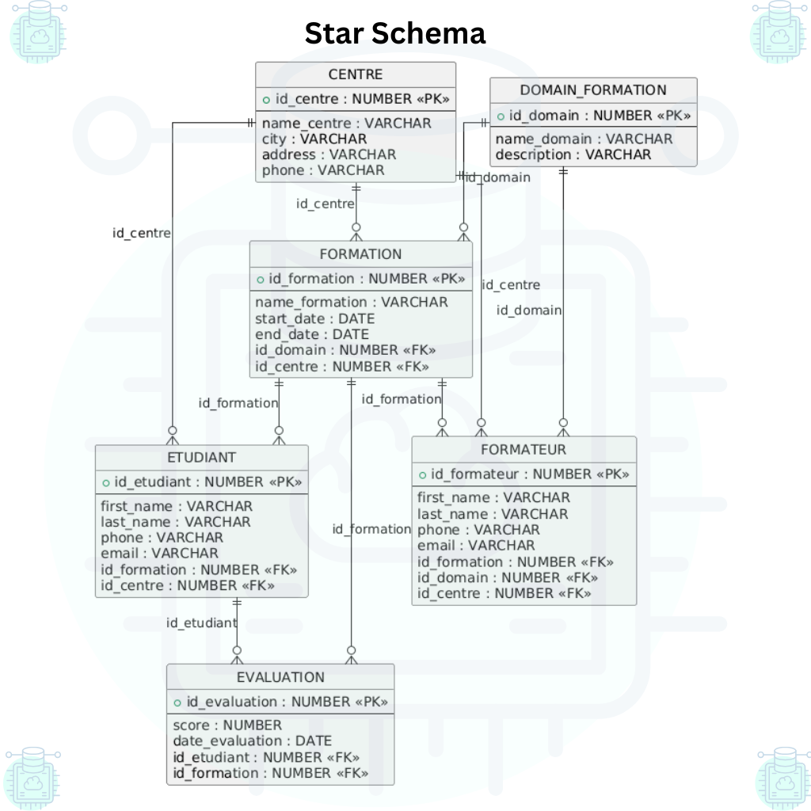

# JobInTech — Conception & Administration Oracle 19c Multi-centres

[](LICENSE) [](https://www.oracle.com)

🗂️ Ce projet décrit la conception et l'administration d'une base Oracle 19c multi-centres pour JobInTech.

Public cible : étudiants DBA, administrateurs Oracle, évaluateurs techniques.

> Ce document couvre uniquement l'administration (CDB/PDB, tablespaces, users, roles, profils, sauvegarde/restauration). Aucune application web/mobile n'est fournie.

---

**Table des matières**

- [Vue d'ensemble](#vue-densemble)
- [Architecture globale (CDB / PDB)](#architecture-globale-cdb--pdb)
- [Stratégie Tablespaces](#stratégie-tablespaces)
- [Modèle logique de données](#modèle-logique-de-données)
- [Star Schema (Data Warehouse)](#star-schema-data-warehouse)
- [Utilisateurs, rôles & sécurité](#utilisateurs-rôles--sécurité)
- [Backup & Recovery (RMAN)](#backup--recovery-rman)
- [Templates SQL & RMAN](#templates-sql--rman)
- [Bonnes pratiques](#bonnes-pratiques)
- [Extensions possibles](#extensions-possibles)
---

## Vue d'ensemble

- Objectif : documenter l'architecture logique, la stratégie tablespace, la sécurité et les procédures de sauvegarde pour `PDB_FORMATION`.
- Inclus : conception logique, strategy tablespaces/indexes, modèle users/roles, stratégie RMAN, templates SQL commentés.
- Exclu : développement applicatif, ETL détaillé.

---

## Architecture globale (CDB / PDB)

ASCII overview :

```text
                                    +-----------------------+
                                    |       CDB (root)      |
                                    |-----------------------|
                                    |  PDB$SEED  |  PDBs    |
                                    |            |-----------------┐
                                    |            | PDB_FORMATION   |
                                    +------------------------------+

                     +-----------------------------------------------+
                     |  PDB_FORMATION (user data)                    |
                     |  - Tablespaces: TS_APP, TS_DATA, TS_AI, ...   |
                     |  - PDB schema for JobInTech                   |
                     +-----------------------------------------------+
```


Remarque : `PDB_FORMATION` contient les données applicatives; la racine CDB gère les métadonnées et l'administration globale.

---

## Stratégie Tablespaces

Recommandation synthétique : séparer données et index, prévoir tablespaces dédiés par usage.

| Département | Tablespace données | Tablespace index |
|---:|:---:|:---:|
| App     | `TS_APP`   | `TS_INDEX` |
| Data    | `TS_DATA`  | `TS_INDEX` |
| AI      | `TS_AI`    | `TS_INDEX` |
| Cyber   | `TS_CYBER` | `TS_INDEX` |
| UI/UX   | `TS_UIUX`  | `TS_INDEX` |
| Admin   | `TS_ADMIN` | `TS_INDEX` |

- Centraliser les index dans `TS_INDEX` facilite maintenance et tuning I/O.
- Option : tablespace par centre pour isolation et quotas.

---

## Modèle logique de données

Tables principales (synthèse) :

| Table | PK | Colonnes clés | Tablespace recommandé |
|---|---|---|---|
| DOMAIN_FORMATION | `id_domain` | `name_domain`, `description` | `TS_DATA` |
| FORMATION | `id_formation` | `name_formation`, `domain_id`, `centre_id`, `start_date`, `end_date` | `TS_APP` |
| ETUDIANT | `id_etudiant` | `first_name`, `last_name`, `phone`, `email`, `formation_id`, `centre_id` | `TS_APP` |
| FORMATEUR | `id_formateur` | `first_name`, `last_name`, `phone`, `email`, `formation_id`, `domain_id`, `centre_id` | `TS_APP` |
| EVALUATION | `id_evaluation` | `etudiant_id`, `formation_id`, `score`, `date_evaluation` | `TS_DATA` (fact) |
| CENTRE | `id_centre` | `name_centre`, `address`, `city`, `phone` | `TS_ADMIN` |

Relations principales :

- `FORMATION.domain_id` → `DOMAIN_FORMATION.id_domain` (N:1)
- `FORMATION.centre_id` → `CENTRE.id_centre` (N:1)
- `ETUDIANT.formation_id` → `FORMATION.id_formation` (N:1)
- `ETUDIANT.centre_id` → `CENTRE.id_centre` (N:1)
- `FORMATEUR.formation_id` → `FORMATION.id_formation` (N:1)
- `FORMATEUR.domain_id` → `DOMAIN_FORMATION.id_domain` (N:1)
- `EVALUATION.etudiant_id` → `ETUDIANT.id_etudiant` (N:1)
- `EVALUATION.formation_id` → `FORMATION.id_formation` (N:1)

Le schéma est normalisé ; utiliser vues et agrégations pour reporting.



---

## Star Schema (Data Warehouse)

- Fact : `EVALUATION` (mesures : `score`, `date_evaluation`)
- Dimensions : `ETUDIANT`, `FORMATION`, `FORMATEUR`, `DOMAIN_FORMATION`, `CENTRE`
- Recommandation : partitionner `EVALUATION` sur `date_evaluation` pour volumétrie importante.

---

## Utilisateurs, Rôles & Sécurité

Rôles proposés :

| Role | Exemple de privilèges |
|---|---|
| `ROLE_APP` | DML (SELECT/INSERT/UPDATE/DELETE) sur tables applicatives |
| `ROLE_DATA` | SELECT pour reporting, accès vues analytiques |
| `ROLE_AI` | Accès contrôlé tables AI/modèles |
| `ROLE_CYBER` | SELECT sur tables d'audit, accès pour contrôles |
| `ROLE_UIUX` | Lecture pour assets de présentation |
| `ROLE_ADMIN` | Gestion users, tablespaces, backups (grants restreints) |

Comptes suggérés : `admin_centre`, `etudiant`, `formateur`.

Sécurité / profils :

- Créer `CREATE PROFILE` pour : `PASSWORD_LIFE_TIME`, `FAILED_LOGIN_ATTEMPTS`, `PASSWORD_LOCK_TIME`.
- Appliquer quotas tablespace par utilisateur si nécessaire.
- Principe : least privilege.

---

## Backup & Recovery (RMAN)

Principes : sauvegarde complète périodique + incrémentales régulières ; ARCHIVELOG activé.

Exemples RMAN :

```sql
-- Full backup de la base (inclut archivelogs)
RMAN> BACKUP DATABASE PLUS ARCHIVELOG;

-- Backup d'un tablespace spécifique
RMAN> BACKUP TABLESPACE TS_APP;

-- Vérifier catalogue / rétention
RMAN> SHOW ALL;
```

Procédures à valider en test : restore tablespace, restore PDB complet, recovery + open resetlogs si requis.

---

## Templates SQL & RMAN (exemples)

Remplacez chemins et mots de passe selon votre environnement.

```sql
-- 1) Créer tablespace (exemple)
-- CREATE TABLESPACE TS_APP DATAFILE '/path/to/ts_app01.dbf' SIZE 20G AUTOEXTEND ON NEXT 5G;

-- 2) Créer user et assigner tablespace
-- CREATE USER admin_centre IDENTIFIED BY "ChangeMe123!" DEFAULT TABLESPACE TS_ADMIN QUOTA UNLIMITED ON TS_ADMIN;
-- GRANT CONNECT TO admin_centre;
-- GRANT ROLE_ADMIN TO admin_centre; -- adapter le grant au rôle créé

-- 3) Exemple de table (format minimal)
CREATE TABLE CENTRE (
    id_centre NUMBER GENERATED BY DEFAULT ON NULL AS IDENTITY PRIMARY KEY,
    name_centre VARCHAR2(20) NOT NULL,
    address VARCHAR2(40),
    city VARCHAR2(10),
    phone VARCHAR2(10)
) TABLESPACE TS_ADMIN;

-- 4) Index centralisé
CREATE INDEX idx_etudiant_email ON ETUDIANT(email) TABLESPACE TS_INDEX;
```

---

## Bonnes pratiques & recommandations

- Séparer données / indexes.
- Mettre en place monitoring (AWR, ASH, OEM) et alerting sur les tablespaces.
- Politiques de mots de passe, comptes de service séparés.
- Documenter et tester procédures de backup/restauration trimestriellement.
- Purger/archiver anciennes données via jobs si besoin.

---

## Extensions possibles

- Tablespace par centre
- Partitionnement de `EVALUATION` (date / centre)
- Automatisation (Ansible, OCI CLI)
- Audit avancé + data masking

---


